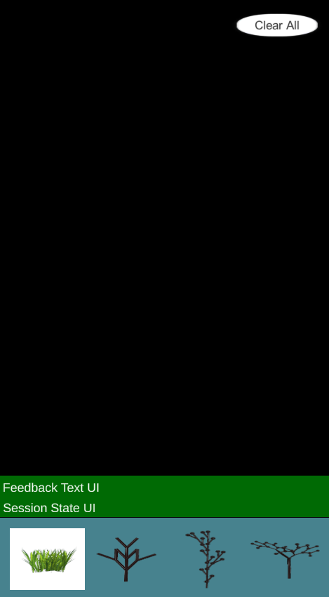

# ARCreation
======================

**University of Pennsylvania, CIS 565: GPU Programming and Architecture, Final Project**

* Guanlin Huang
 * [LinkedIn](https://www.linkedin.com/in/guanlin-huang-4406668502/), [personal website](virulentkid.github.io/personal_web/index.html)
 * Tested on: Samsung Tablet S8, Qualcomm SM8450 Snapdragon 8 Gen 1;CPU: Octa-core (1x3.00 GHz Cortex-X2 & 3x2.50 GHz Cortex-A710 & 4x1.80 GHz Cortex-A510), GPU: 	Adreno 730

* Rhuta Joshi

* Shutong Wu

## Installation
Download and install the .APK file to your android device.

## Usage Instruction
Tap the assets you want to "summon" at the bottom of this app, and then tap on the white-dotted area of the scene from your camera to create it.
  

Overview
===========
ARCreation, or ARC, is proposed to be an application for adding procedural elements to the real world view...

## Grass
The grass is rendered through Unity Universal Render Pipeline shaders.
  
In order to have grass curvature and convincing grass movement, each blade of grass is divided into a number of segments. Comparing to tessellation, this method saves more memory and is more efficient to construct and compute. 
  

  
The wind is implemented by sampling from a noise texture. the UV coordinate is constructed using the grass blades' input points; this will ensure that with multiple grass instances they will behave the same. The wind is then applied using a scaled rotation matrix to each segment of the grass blade.
  

  
Similar to how wind is applied, the interaction bending is applied with the scaled rotation matrix with respect to the distance of the device and grass
  

  
## GPU-based L-system

## Performance Analysis

### Performance Notes on grass

  
  
  
## Future Work

## Credits
* [Grass Shader Tutorial](https://roystan.net/articles/grass-shader/)

## Blooper
"May the force be with you"
  
  
