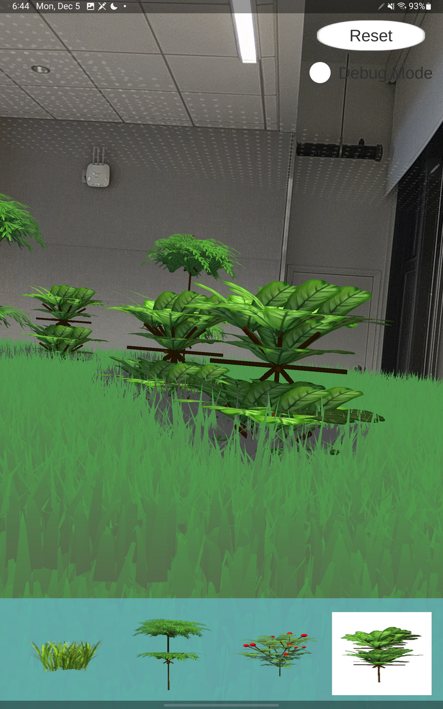
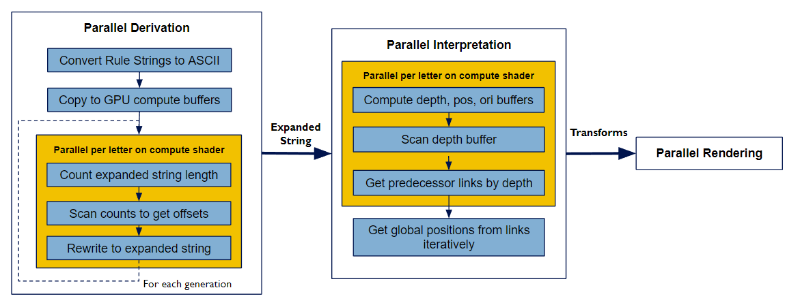
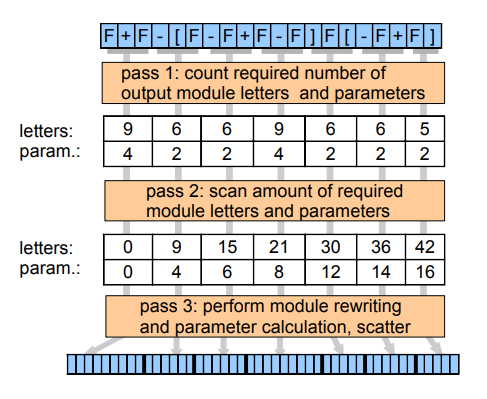
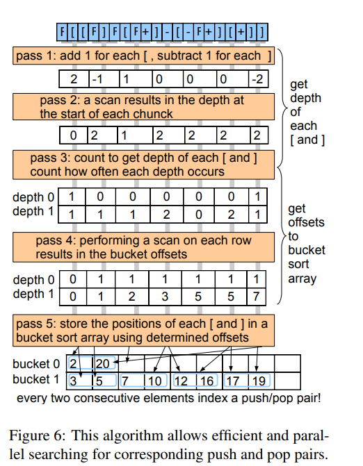
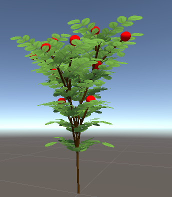
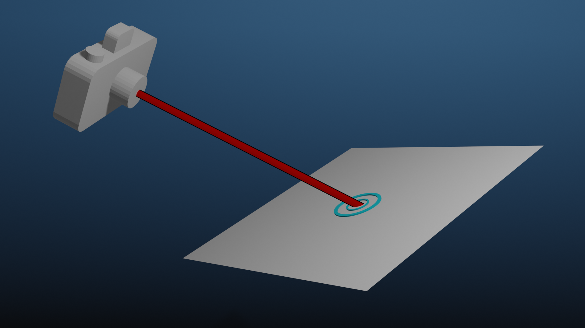
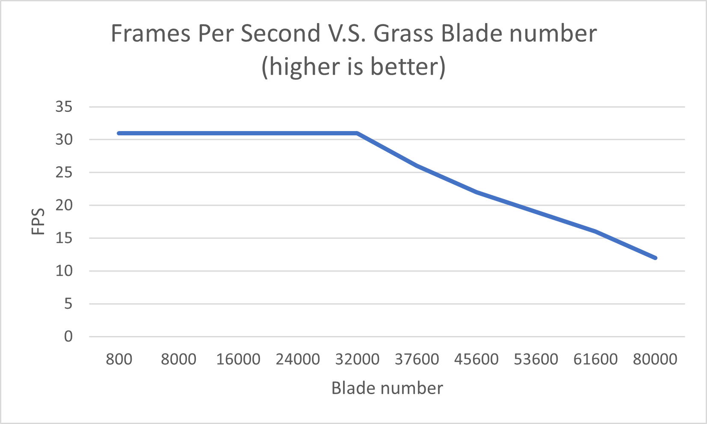
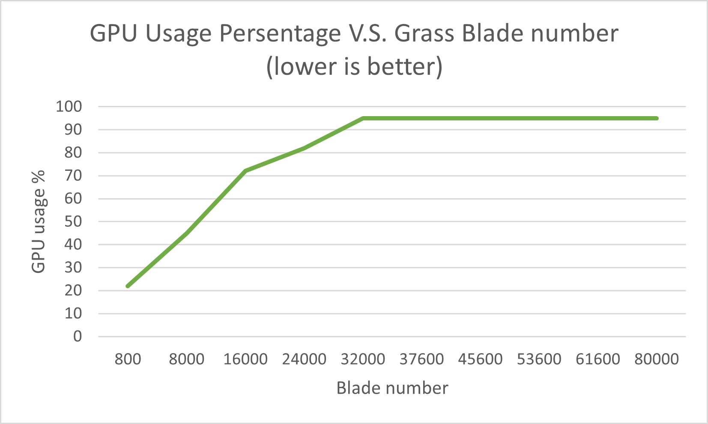
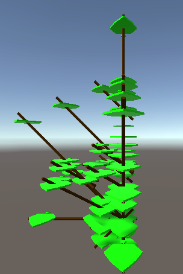
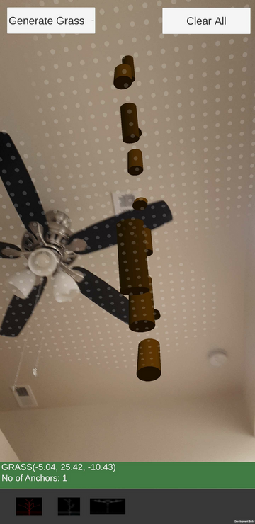

# 
 ARC or ARCreation : AR app for procedural generation 

**University of Pennsylvania, CIS 565: GPU Programming and Architecture, Final Project**

* [Guanlin Huang](https://www.linkedin.com/in/guanlin-huang-4406668502/), [Shutong Wu](https://www.linkedin.com/in/shutong-wu-214043172/), [Rhuta Joshi]()
 * Tested on: Samsung Tablet S8, Qualcomm SM8450 Snapdragon 8 Gen 1;CPU: Octa-core (1x3.00 GHz Cortex-X2 & 3x2.50 GHz Cortex-A710 & 4x1.80 GHz Cortex-A510), GPU: 	Adreno 730

Overview
===========
Project ARC is proposed to implement an application for adding procedural elements to the real world view. One hidden problem of procedural generation is its performance with large number of generations, and we intent to solve this with GPU. We have implemented grass and customized L-system in Unity and show it in AR with Unity AR Foundation.   

|Basic design of application|
|---|
||

### Installation
Download and install the .APK file to your android device. AR experiences on Android devices are driven by ARCore, which is available on [ARCore supported devices](https://developers.google.com/ar/devices). Ensure that your development device is compatible with AR. Alternatively, you can use a correctly configured AR-compatible Android Emulator instance.

### Usage Instruction
Tap the assets you want to see at the bottom of the screen, and then tap on the phone to create it.  

[Video of usage demonstration here](https://linksharing.samsungcloud.com/hIEd5AV9jhCG)

### Developer Notes

Developed using Unity 2021.3.13f1, version control system used during development - Plastic SCM

### Implementation contents

- [Grass](#grass)
- [GPU-based L-system](#gpu-based-l-system)
  - [L-System Derivation & Interpretation](#l-system-derivation-and-interpretation)
  - [L-System Rendering](#l-system-rendering)
  - [2D Noise Procedural Generation](#2d-noise-procedural-generation)
- [Integrating it with AR](#integrating-it-with-ar)

Implementation
===========
## Grass
The grass is rendered through Unity Universal Render Pipeline shaders.
  
In order to have grass curvature and convincing grass movement, each blade of grass is divided into a number of segments. Comparing to tessellation, this method saves more memory and is more efficient to construct and compute. 
  

  
The wind is implemented by sampling from a noise texture. the UV coordinate is constructed using the grass blades' input points; this will ensure that with multiple grass instances they will behave the same. The wind is then applied using a scaled rotation matrix to each segment of the grass blade.
  

  
Similar to how wind is applied, the interaction bending is applied with the scaled rotation matrix with respect to the distance of the device and grass
  

  
## GPU-based L-system
We implement our L-system generation process based on the paper [Parallel Generation of L-Systems](https://publik.tuwien.ac.at/files/PubDat_181216.pdf). Unlike the paper which uses CUDA to implement the L-System, we are using Unity with its compute shader for generation. The implementation can be broken down to three parts: 
* L-System Derivation : Turn the axiom string to a derived string based on selected rulesets
* L-System Interpretation: Transform the string to a list of position/orientation/material array that we use to draw for each symbol
* Rendering: render all the items in the array to the scene

### L-System Derivation and Interpretation

Overall our workflow looks as follows:   
   

Before the derivation starts, there will be a preparation step where every customized rulesets will be loaded into the script, and the compute shader will know what each character will derive into. 
In the derivation process, each thread will take care of each character in the string, and a prefix sum scan function is used to calculate the total length of the new derived string. Because Compute Shader does not accept character, we are converting character to ASCII code to make sure the dispatch of compute shader goes smoothly.  
In each iteration of derivation(L-System might go many iterations), we will first use the scan function to examine the total string length of next iteration's derived string, then we use the prefix sum array to identify the derived characters' indices in the new string. A new string will be generated after this step. 
Our scan function can deal with 512*512 = 262144 elements for each L-System, and it is sufficient for this project and basically the most complex L-system generation. 

 

This is the paper's approach to the interpretation, but after careful thinking we decide to use a 1D linked list to help finish the interpretation in a simpler fashion. 
After we get all the strings from derivation, we will then set data for: 
* SymbolBuffer: A compute buffer that identify if each character is a symbol(Something to draw) or not
* DepthBuffer: A compute buffer that identify each character's depth
* PosBuffer/OriBuffer: A kernel that identify the position/orientation vector that the character might change to the next character 

 

Then after a prefix sum scan of the Depth buffer and Pos/Ori Buffer, we will then set data for LinkedBuffer, where each index will store its parent's index. This solves the hardest problem when constructing L-system, which is to have every symbol to have its predecessor's data. 
Then we will iterate through the array, fetching all the symbols that need to be draw and their local coordinates. The interpretation marks complete up to this point.

### L-System Rendering
 

we have arranged two ways, one in CPU and one in GPU, to render L-System based on different needs.  
For CPU, we simply instantiate the gameobject we have for each symbol and under not complex scenes their performance is relatively acceptive. The point of keeping this is for debugging and to compare its performance against GPU rendering in terms of simple to not very complex(below 100 L-system) scene.  
For GPU, we originally passed the mesh/vertex/triangles information to vertex shader and run a shader file to render this at runtime; but during search we find Unity have a DrawProcedural and DrawMesh function, where we can let GPU render mesh at giving world coordinates at runtime, so we also implement this rendering procedure.

### 2D Noise Procedural Generation

## Integrating it with AR

ARCore is Google's framework for building augmented reality experiences on smartphones. We are using Unity's AR Foundation to build this application. We need to take care of two things - detecting surfaces/planes and placing objects in real world scene based on user interaction like tap or dragging on screen. This is mainly accomplished using the following:

1. ARPlaneManager - An ARPlaneManager detects ARPlanes and creates, updates, and removes game objects when the device's understanding of the environment changes.
2. ARRaycastManager - An ARRaycastManager exposes raycast functionality in which we shoot a ray from the screen coordinates of our tap into the real world detected and we store the intersection points as hit points. Refer to the image shown below taken from Google Cdoelabs.
3. ARAnchorManager - ARAnchorManager is used to track elements (gameobjects) in the real world. In our application, we are tracking each lsystem that the user places so that we can interact with them better and befause we want to anchor and orient them correctly along the plane detected. The number of anchors can be reduced since they are resource-intensive. 

## Performance Analysis
 * Tested on: Samsung Tablet S8, Qualcomm SM8450 Snapdragon 8 Gen 1;CPU: Octa-core (1x3.00 GHz Cortex-X2 & 3x2.50 GHz Cortex-A710 & 4x1.80 GHz Cortex-A510), GPU: 	Adreno 730  

 For the performance analysis we will first do a analysis on each of the component we have implemented, and then we will analyze the overall performance to show that using GPU for L-system generation is a efficient idea.

### Grass Performance

  
  
### L-System Performance CPU vs GPU

### L-System Performance Ours vs Online Resources

### Overall Performance
 
## Future Work

## Credits
* [Parallel Generation of L-Systems](https://publik.tuwien.ac.at/files/PubDat_181216.pdf)
* [Grass Shader Tutorial](https://roystan.net/articles/grass-shader/)

## Presentation and other documentation
[Project board, bug tracker and resources](https://cis-565-final-project.notion.site/Team-ARC-f8764bf740f6408ebb3c7bdedbad31f6)
[Milestone 1 Presentation](https://docs.google.com/presentation/d/16BDfPikoMo0FX5iWDb8mwlZ5nQAJBaDj30A9Vw1sQ5o/edit#slide=id.p) 
[Milestone 2 Presentation](https://docs.google.com/presentation/d/1iHksZZ4u2Z6-Yoie_S-0kXjdsAEHsFWQpKVJzvuKXFI/edit#slide=id.p) 
[Milestone 3 Presentation](https://docs.google.com/presentation/d/1cWZAUilfjqYLi6OaeJzwCYyNQ0r6AfFJXVTBsvolfYg/edit#slide=id.g19cafe9bbc4_0_3) 
[Final Presentation]()

## Blooper
"May the force be with you"   
  

"Grammatical mistakes"   

"Copy paste"   

"Reaching for the skies" or "Flying branches"   

